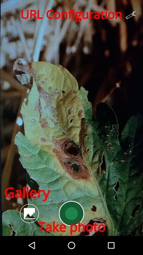
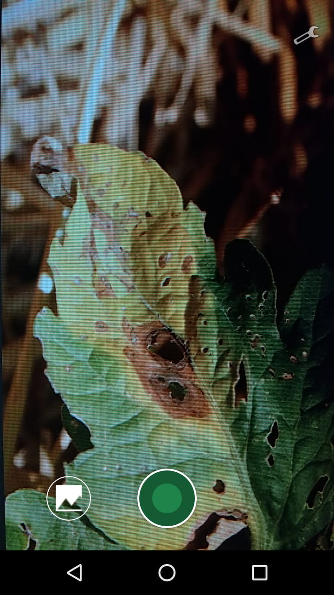
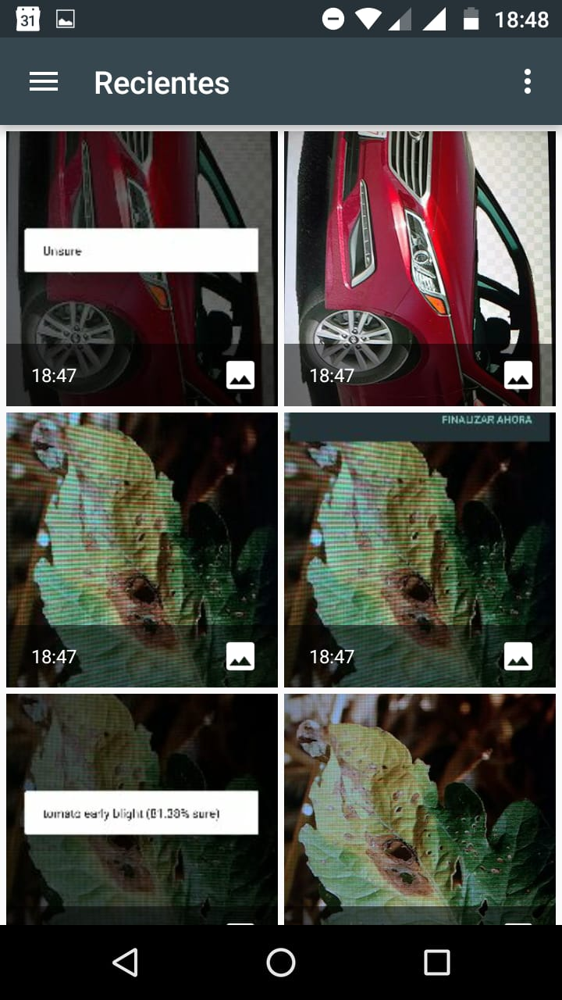
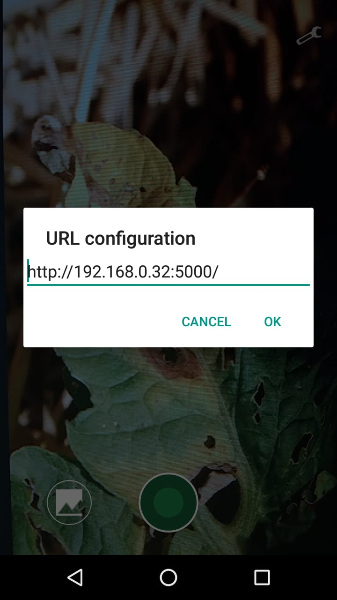
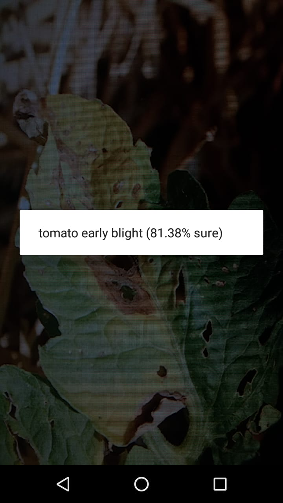

# IAgro
## Orientación a Objetos 2 - Trabajo final - UNLP Informática

El presente trabajo es una aplicación Android, desarrollada en conjunto por alumnos de la UNLP.
El grupo estuvo compuesto por Franco Emanuel Liptak y Gastón Gustavo Ríos, con dirección de Matías Urbieta.

El objetivo fue que, gracias a la aplicación Android, se pueda hacer uso de una red neuronal (desarrollada por Paolo Stancato) la cual es capaz de detectar enfermedades en plantas.

---

## Manual de usuario

Al levantar por primera vez la aplicación, se le pedirá al usuario que brinde los permisos necesarios. Sin estos permisos la aplicación no funcionará (se pedirán nuevamente hasta ser aceptados).

Luego, el usuario podrá realizar 3 acciones: 

1. Tomar una foto.

2. Seleccionar una imagen desde la galería.

3. Configurar la URL donde está alojada la red neuronal.

Tanto el punto 1 como también el punto 2 realizan una conexión hacia el servidor, y le envían la imágen en cuestión a la red.

Es posible que la red no pueda detectar una enfermedad con precisión aceptable (por ejemplo, si se le envía una foto donde no aparece una planta). En tal caso, nuestra aplicación dirá que no está segura sobre el resultado.

Para aquellas imágenes donde la red neuronal devuelve una probabilidad de 0.6 o mayor, se informará al usuario en pantalla el nombre de la enfermedad y su seguridad.

